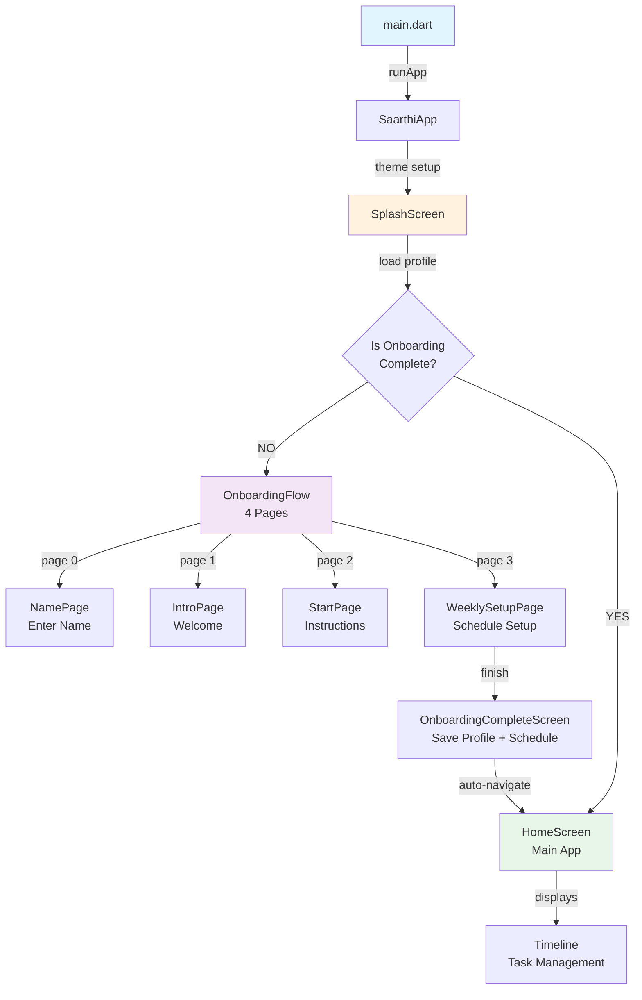
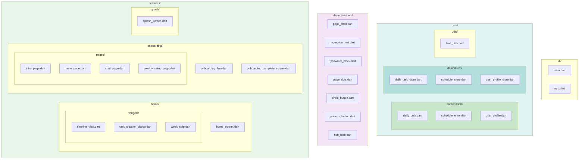
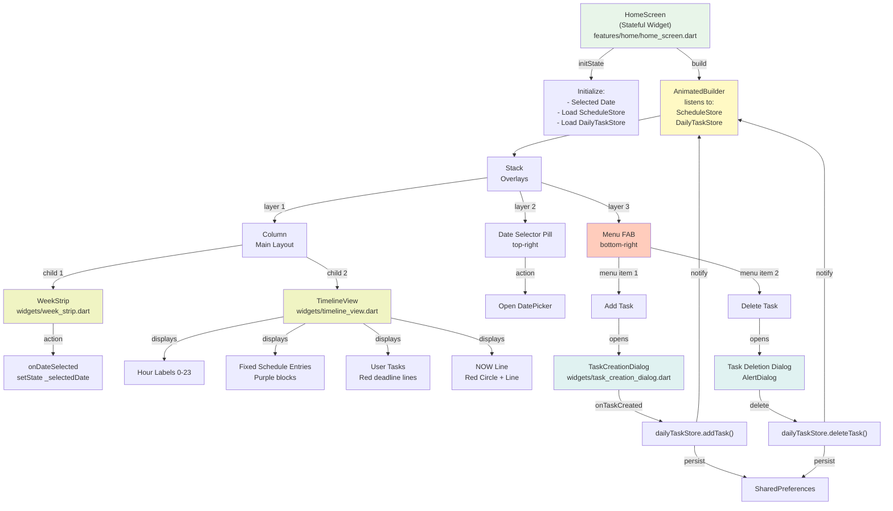
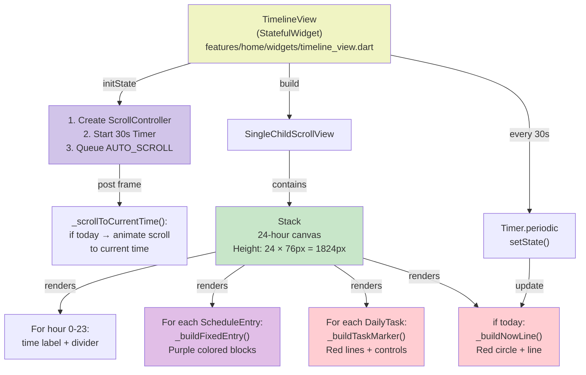
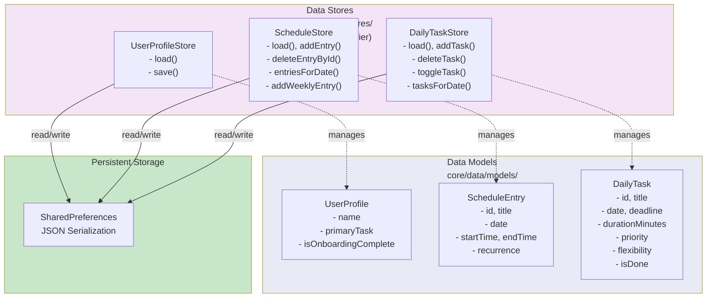
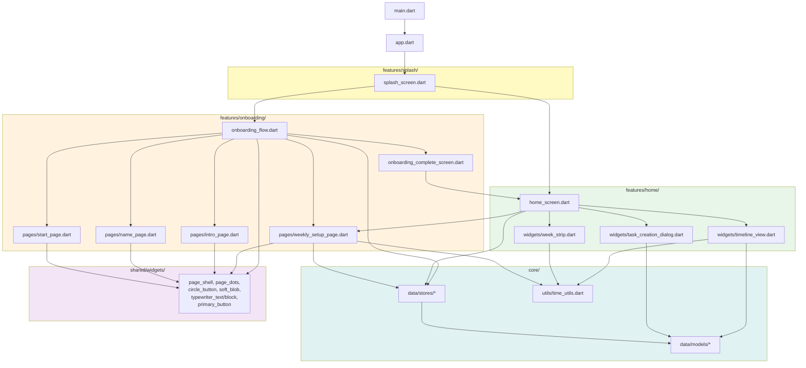
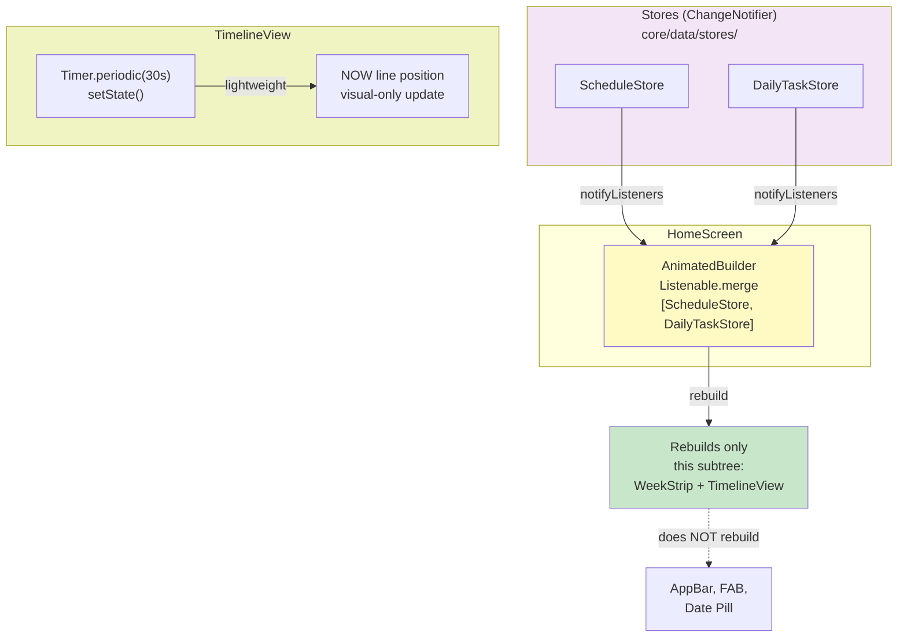
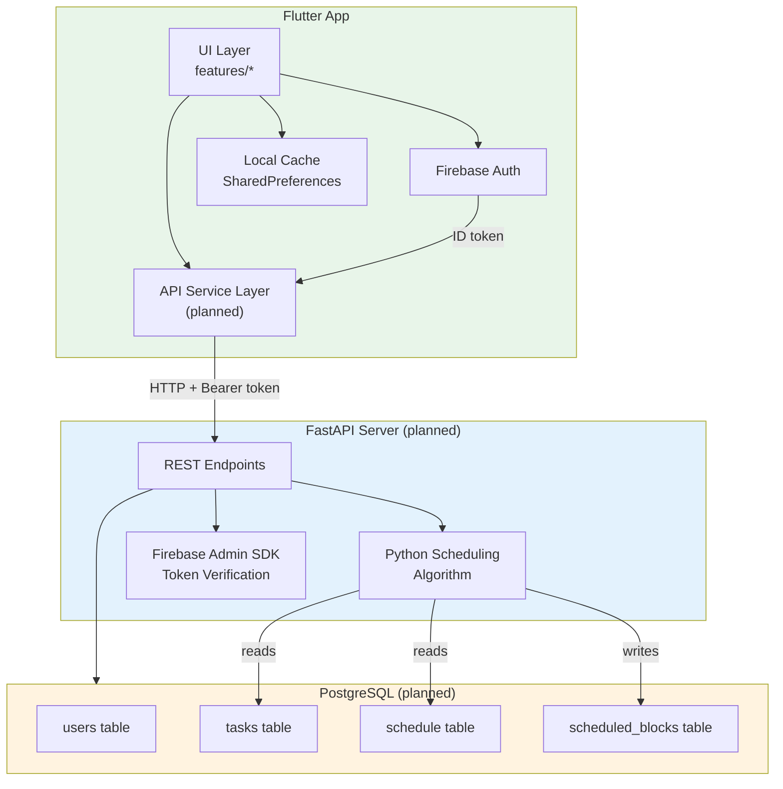

# Saarthi — Visual Architecture Diagrams

## 1. Application Navigation Flow

---

## 2. Project File Structure

---

## 3. HomeScreen — Component Structure

---

## 4. Timeline View — Detailed Structure

---

## 5. Task Creation Dialog Flow

```mermaid
graph LR
    TCD["TaskCreationDialog<br/>features/home/widgets/<br/>task_creation_dialog.dart"]
    
    TCD --> INPUT["Input Collection:<br/>- Task name<br/>- Deadline date<br/>- Deadline time<br/>- Duration slider<br/>15-480 min<br/>- Priority slider<br/>1-5<br/>- Flexibility toggle"]
    
    INPUT --> VALIDATE["Validation:<br/>- Name not empty?"]
    
    VALIDATE -->|FAIL| ERROR["Show error<br/>Stay in dialog"]
    VALIDATE -->|PASS| BUILD["Build DateTime<br/>from date + time"]
    
    BUILD --> CREATE_CALL["onTaskCreated()<br/>callback"]
    
    CREATE_CALL --> ADD_TASK["DailyTaskStore<br/>.addTask()"]
    
    ADD_TASK --> PERSIST["_persist():<br/>Write JSON<br/>to SharedPreferences"]
    
    PERSIST --> NOTIFY["notifyListeners()"]
    
    NOTIFY --> REBUILD["AnimatedBuilder<br/>rebuilds"]
    
    REBUILD --> APPEAR["Task appears<br/>on timeline<br/>as red deadline line"]
    
    style TCD fill:#e0f2f1
    style INPUT fill:#e1f5fe
    style VALIDATE fill:#fff9c4
    style ERROR fill:#ffcdd2
    style PERSIST fill:#c8e6c9
    style APPEAR fill:#f0f4c3
```

---

## 6. Data Architecture

---

## 7. File Dependencies Graph

---

## 8. Onboarding Flow — Page Progression

```mermaid
graph LR
    OF["OnboardingFlow<br/>PageController<br/>features/onboarding/<br/>onboarding_flow.dart"]
    
    OF -->|page 0| P0["NamePage<br/>Enter Name"]
    P0 -->|next| CHECK1{Name<br/>entered?}
    
    CHECK1 -->|NO| ERROR1["Show error<br/>Block progression"]
    ERROR1 -->|retry| P0
    
    CHECK1 -->|YES| P1["IntroPage<br/>Welcome Message"]
    P1 -->|next| P2["StartPage<br/>Schedule Instructions"]
    
    P2 -->|next| P3["WeeklySetupPage<br/>7-day schedule<br/>Add time slots"]
    
    P3 -->|finish button| FINISH["_finishOnboarding()"]
    
    FINISH -->|validate| CHECK2{Has weekly<br/>entries?}
    CHECK2 -->|NO| ERROR2["Show error:<br/>Add at least 1 slot"]
    CHECK2 -->|YES| SAVE["Save UserProfile<br/>isOnboardingComplete=true"]
    
    SAVE --> COMPLETE["OnboardingCompleteScreen<br/>Loading transition"]
    COMPLETE -->|auto 2.2s| HOME["HomeScreen"]
    
    style OF fill:#f3e5f5
    style P0 fill:#ede7f6
    style P1 fill:#e1f5fe
    style P2 fill:#f1f8e9
    style P3 fill:#fff3e0
    style HOME fill:#e8f5e9
```

---

## 9. State Update Flow

---

## 10. Planned Architecture — With Backend

---

## Summary

These diagrams provide visual representation of:
- ✅ Application navigation & lifecycle
- ✅ Project file structure & organization
- ✅ Component hierarchy & data flow
- ✅ User interaction flows
- ✅ State management patterns
- ✅ Persistence & storage architecture
- ✅ File dependencies
- ✅ Planned backend architecture

---

**Last Updated:** April 10, 2026  
**App Version:** v1.0 (Onboarding + Timeline)
