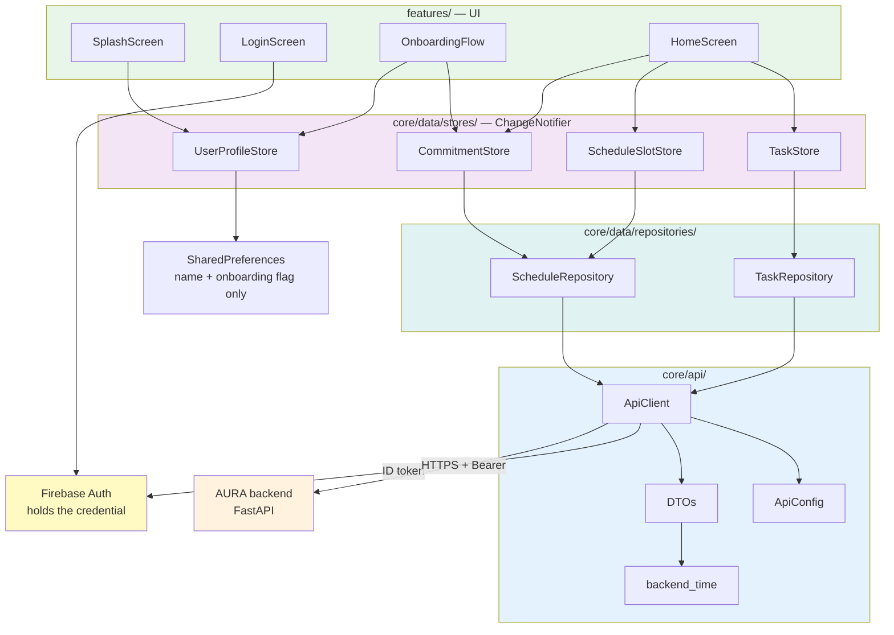
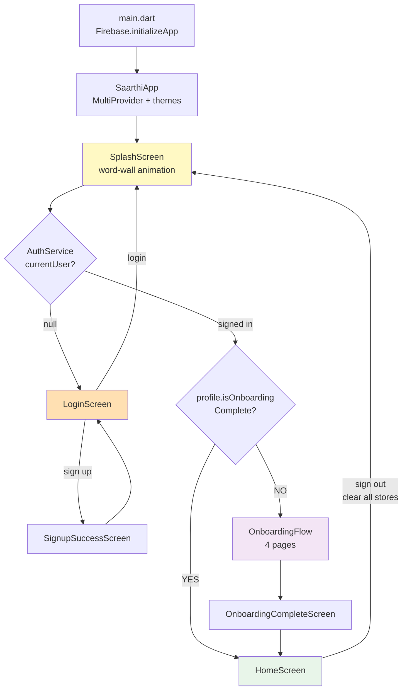
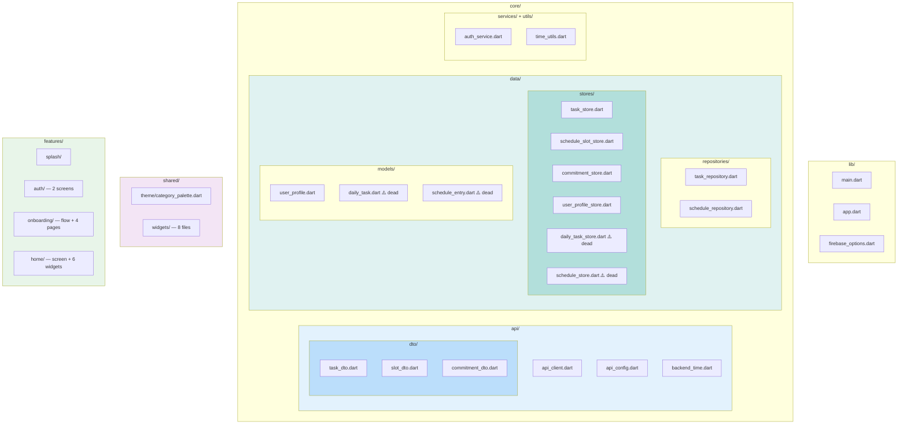
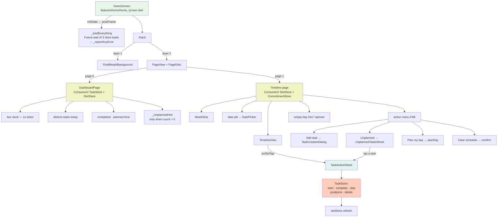
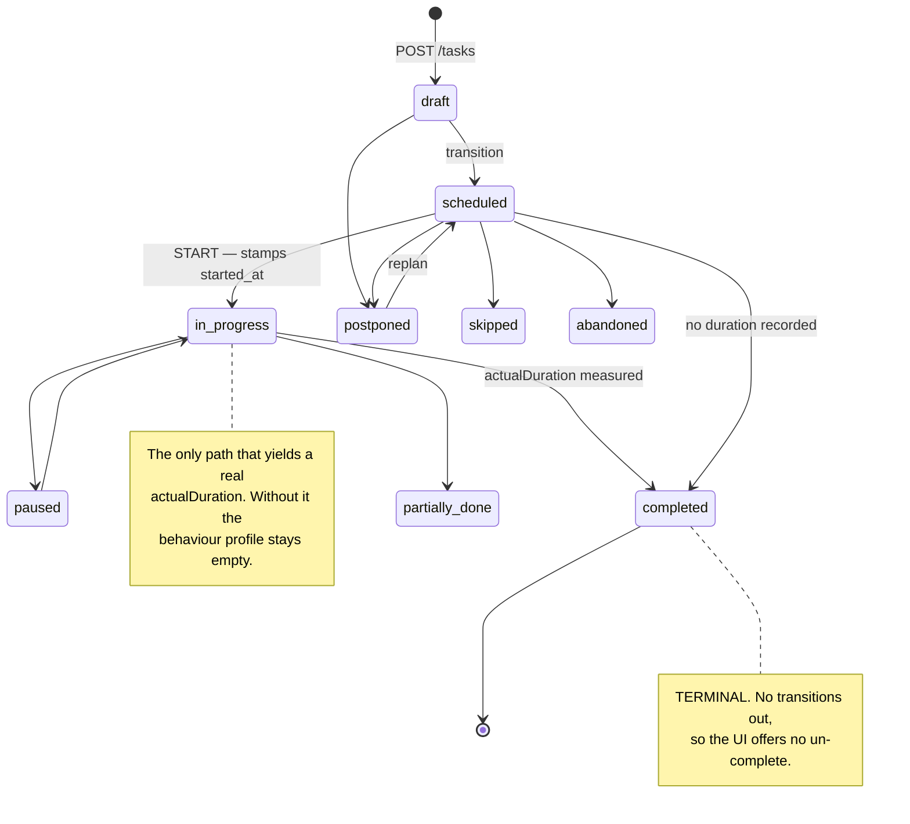
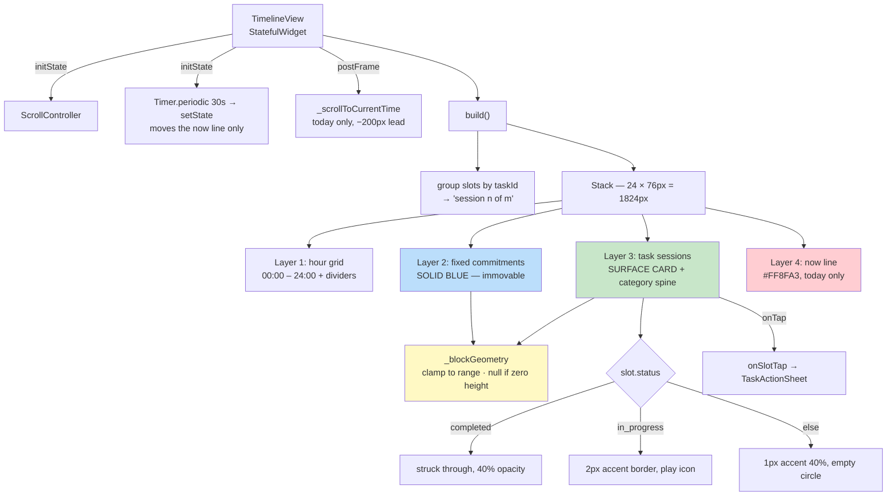
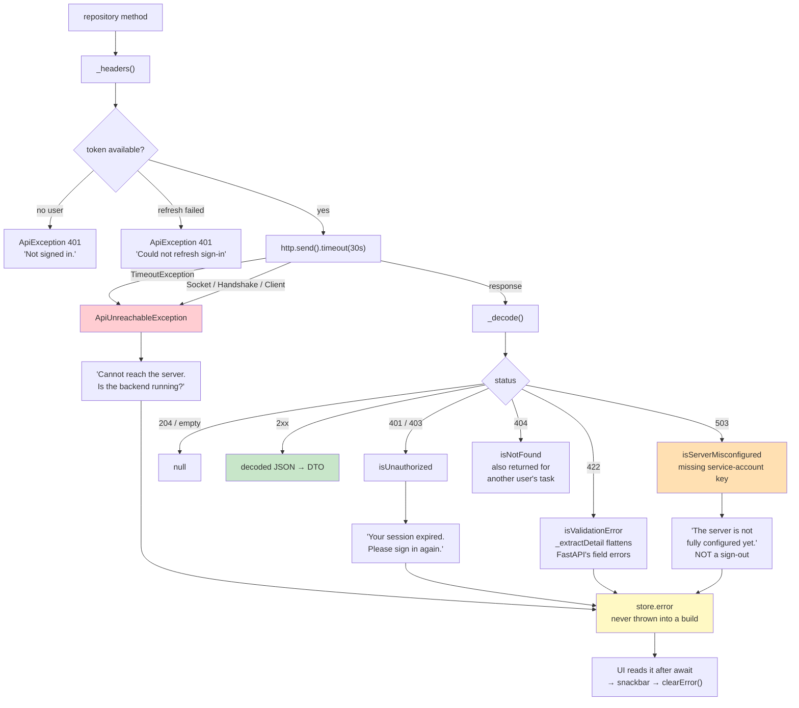
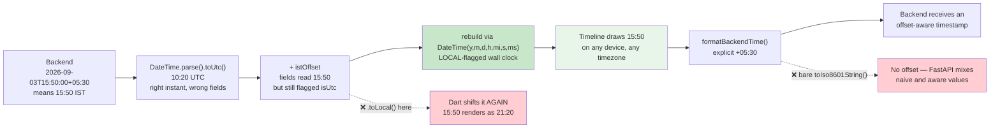
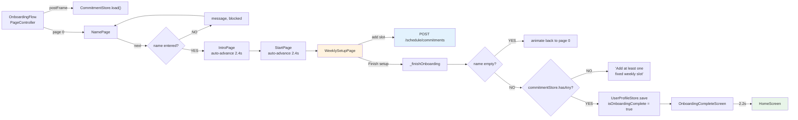
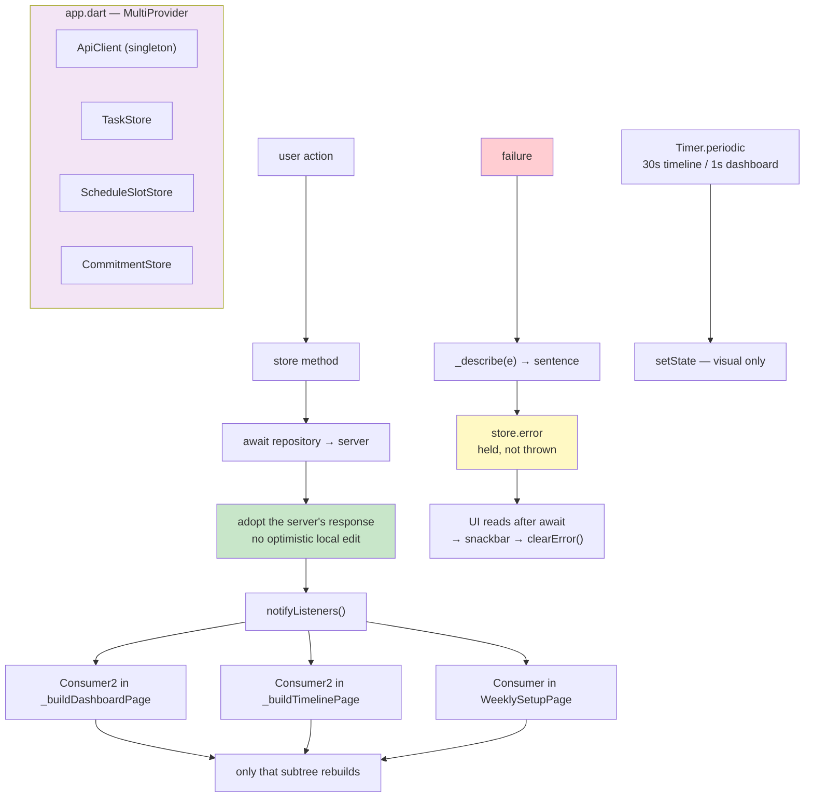

# Saarthi — Visual Architecture Diagrams

Diagrams for the **backend-integrated** app. The server is the source of truth;
tasks have no local day, and the scheduler decides placement.

---

## 1. Layered Architecture



Each layer has one job. UI never touches `ApiClient`. Repositories never hold
state. `ApiClient` never knows what a task is.

---

## 2. Navigation & Auth Routing



Sign-up deliberately routes **back to login** rather than into the app, forcing
the credentials to be verified once. The splash screen re-runs its routing after
a successful login, so there is one routing decision, in one place.

---

## 3. Project File Structure



---

## 4. HomeScreen — Component Structure



The dashboard receives slots **only when the loaded day is really today** — a
counter that silently described a day the user merely browsed to would be worse
than no counter.

---

## 5. "Plan my day" — Sequence

```mermaid
sequenceDiagram
    actor U as User
    participant H as HomeScreen
    participant S as ScheduleSlotStore
    participant R as ScheduleRepository
    participant A as ApiClient
    participant B as AURA backend
    participant T as TaskStore

    U->>H: Menu → "Plan my day"
    H->>S: planDay()
    S->>S: isPlanning = true, notify
    S->>R: planSchedule()
    R->>A: POST /schedule/cpsat
    A->>A: getIdToken() → Bearer header
    A->>B: HTTP (30s timeout)
    B->>B: CP-SAT over every pending task
    B-->>A: scheduled[], dropped[], solve_status
    A-->>R: JSON
    R-->>S: CpsatResultDto

    Note over S: response carries NO slot ids
    S->>R: getDaySchedule(loadedDate)
    R->>B: GET /schedule/day?date=...
    B-->>S: booked_slots (with slot ids), free_gaps
    S->>S: isPlanning = false, notify

    S-->>H: CpsatResultDto
    H->>T: load()
    Note over H,T: planning changed task statuses;<br/>the unplanned count would go stale

    alt dropped is not empty
        H->>U: "Placed N. Could not fit: X, Y"
    else nothing pending
        H->>U: "Nothing to plan — add a task first."
    else success
        H->>U: "Placed N sessions."
    end
```

The refresh is not optional and the task reload is not optional. Those two
follow-ups are what keep block ids available and the unplanned badge honest.

---

## 6. Task State Machine



Transitions are enforced **server-side**. `draft → completed` is rejected, which
is why the client uses `/complete`, `/postpone` and `/skip` — the server walks
the intermediate steps itself.

---

## 7. Timeline Rendering



The two block styles are deliberately different: a user must tell at a glance
what is immovable from what the app decided, because only the latter can be
started, finished or moved. Both share `_blockGeometry`, so equal-length blocks
always line up exactly.

---

## 8. Request Lifecycle & Error Taxonomy



Separating 503 from 401 is the point of the whole taxonomy: a missing server key
is not the user's fault, and reporting it as 401 would loop the app trying to
re-authenticate against a broken server.

---

## 9. Timezone Conversion



The device timezone is irrelevant. The scheduler's intent is expressed in IST, so
the UI renders IST — never `.toLocal()`.

---

## 10. Onboarding Flow



At least one commitment is required because the scheduler needs some shape of a
week to work around — otherwise every hour looks equally free and the plan is
meaningless. These go to the **server**, not local storage: kept locally, CP-SAT
could never see them, and every user was scheduled around one hardcoded
timetable.

---

## 11. State Update Flow



Counters such as `procrastinationCount` are computed server-side, so a local
guess would drift. Every mutation awaits the server and swaps the local copy for
what comes back.

---

## Summary

| Diagram | Shows |
|---|---|
| 1 | Layer boundaries and what talks to what |
| 2 | Auth routing and where sign-up goes |
| 3 | File structure, including the four dead files |
| 4 | HomeScreen composition and its actions |
| 5 | Why "Plan my day" needs two follow-up fetches |
| 6 | The server-enforced task state machine |
| 7 | Timeline layers and why block styles differ |
| 8 | The error taxonomy, especially 401 vs 503 |
| 9 | IST handling and the two bugs it prevents |
| 10 | Onboarding gates and where commitments go |
| 11 | How a mutation reaches the screen |

---

**Last Updated:** September 7, 2026
**App Version:** 1.0.0+1 — backend-integrated (Phase 6)
